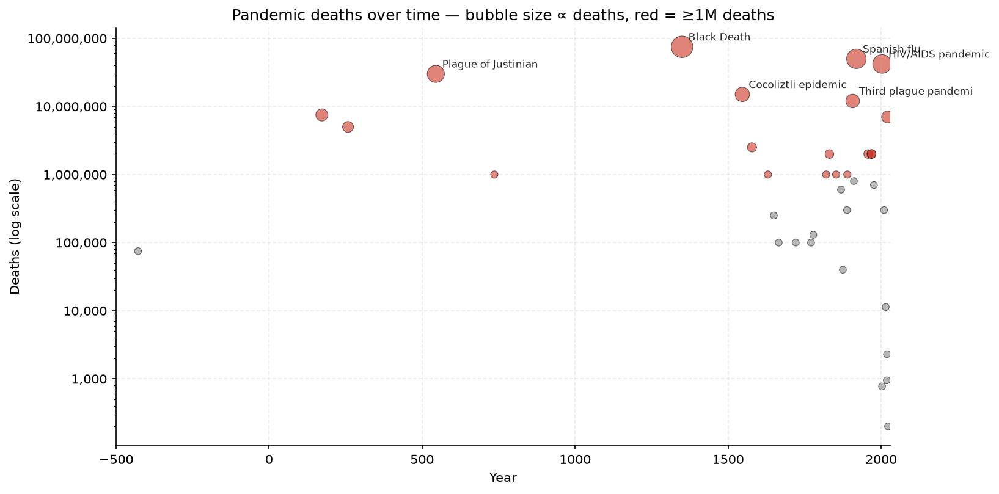
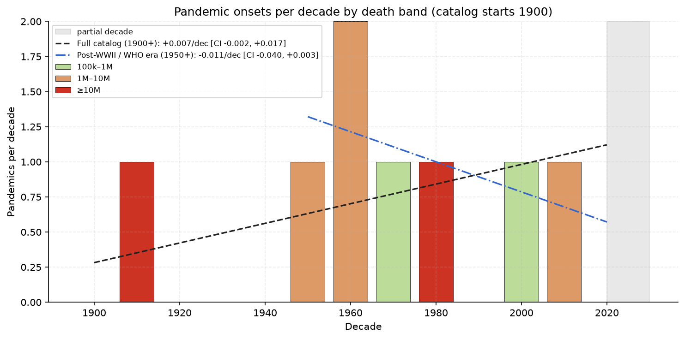
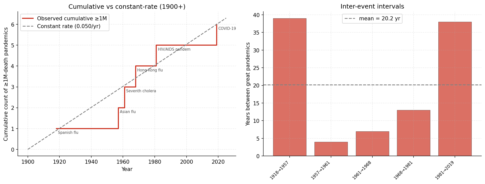
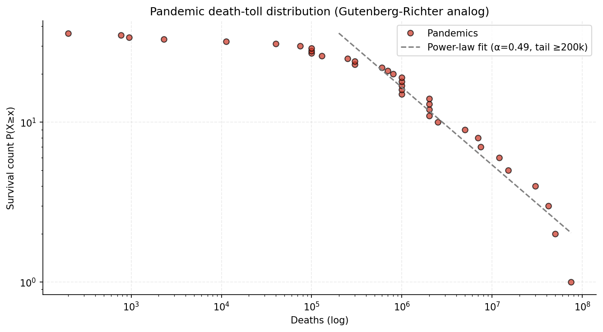

# pandemics-tracking

Hand-curated catalog of major pandemics and epidemics from antiquity to present, parallel in spirit to `earthquakes`, `spaceweather`, `famines-tracking`, and `flood-data`.

## Quick findings

- **19 pandemics with ≥1M deaths** in the catalog; 6 with ≥10M.
- **Spanish flu (1918–20, ~50M) and Black Death (1346–53, ~75M) dominate** the top of the distribution; HIV/AIDS cumulative (~42M) is the modern equivalent.
- **No ≥1M-death event between Hong Kong flu (1968) and HIV/AIDS (1981 onset)** — that's the longest single-event gap in the modern catalog before COVID-19.
- **Death-toll distribution is fat-tailed**, the same regime Cirillo & Taleb document for war casualties and Ó Gráda for famines.
- **Post-1900 decadal trend = +0.007 pandemics/decade [95% CI −0.002, +0.017]** — statistically flat.

## Sample output

### Pandemic deaths over time

Bubble size scales with deaths; red highlights ≥1M-death events. The Black Death, Plague of Justinian, and Spanish Flu sit at the top of the log scale; the modern era (1900+) adds HIV/AIDS and COVID-19 to the very-large band.



### Pandemics per decade by death band

Stacked bars: pandemics per decade since 1900, partitioned by death band (100k–1M, 1M–10M, ≥10M). Dashed line is an OLS fit on complete decades — flat, with the 95% bootstrap CI crossing zero. The 1920s spike is Spanish flu; the 2020s bar is COVID-19 but is shaded grey because the decade isn't complete yet.



### Great pandemic timing (≥1M deaths)

Cumulative count of ≥1M-death pandemics since 1900 vs a constant-rate reference line, and the bar chart of inter-event intervals. The 1968→1981 gap (Hong Kong flu → HIV/AIDS onset) and the long 1957→2009 gap between novel flu pandemics are visible. Recent events (COVID-19 2019) land roughly on the constant-rate line.



### Magnitude distribution

Log-log survival function. The dashed line is a power-law fit on the tail (deaths ≥ 200k). The slope α gives the Gutenberg-Richter-analog exponent.



## What's in it

`pandemics.csv` — ~36 major events with columns:

- `start_year`, `end_year` — duration; deaths spread evenly across years for active-deaths analyses
- `name` — common scholarly designation
- `region`
- `deaths_estimate` — published consensus where one exists, otherwise scholarly midpoint
- `sources_notes` — source author or attribution

Coverage: Plague of Athens (430 BC) → mpox (2022). Includes the major plague pandemics, cholera pandemics (1817–1923 numbered 1–6), flu pandemics (1889, 1918, 1957, 1968, 1976, 2009), HIV/AIDS, COVID-19, and notable regional epidemics like the 1545 Cocoliztli outbreak in Mesoamerica.

## Detection-bias caveats

| Era | Catalog completeness |
|---|---|
| Pre-1500 | Anecdotal — only the very largest and best-attested events. Death tolls are orders of magnitude. |
| 1500–1850 | Concentrated on European and Eastern Mediterranean events; non-Western pandemics underrepresented. |
| 1850–1950 | Improving with germ theory and global health institutions. Cholera pandemics are well-documented. |
| 1950–present | WHO-monitored; near-complete for events killing ≥1000 globally. |

Treat any cross-era comparison with these caveats in mind. The plots use 1900+ for trend fits (the post-germ-theory era when global tracking became reasonably comparable).

## Reproducing the plots

```bash
python3 -m venv .venv
.venv/bin/pip install pandas numpy matplotlib
.venv/bin/python make_plots.py
```

## Sources

Compiled from:
- Hays, J. N. (2005). *Epidemics and Pandemics: Their Impacts on Human History.*
- Snowden, F. M. (2019). *Epidemics and Society: From the Black Death to the Present.*
- WHO disease outbreak news (https://www.who.int/emergencies/disease-outbreak-news)
- Our World in Data pandemic mortality dataset (https://ourworldindata.org/pandemics)
- Acuña-Soto, R. et al. (2002). *Megadrought and megadeath in 16th century Mexico.* Emerging Infectious Diseases.
- Fenn, E. A. (2001). *Pox Americana: The Great Smallpox Epidemic of 1775–82.*

Death-toll estimates differ widely across sources for pre-1900 events; this CSV uses scholarly midpoint estimates. For active research, consult Our World in Data's underlying dataset.

## Intended use

This repo is the data source for the pandemic correlation tests in [`Biblejustin/correlations`](https://github.com/Biblejustin/correlations).
